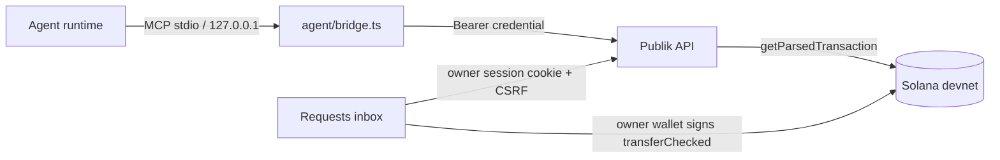
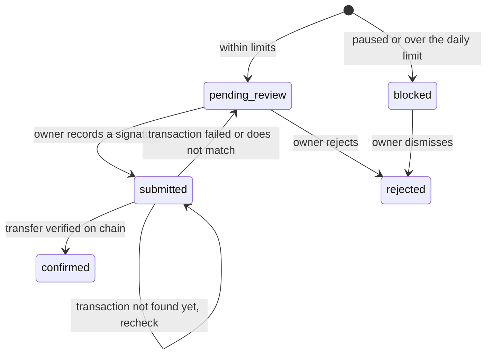

# Owner review loop and devnet proofs

Status: active · Scope: feature (owner-signed mode) · Last updated: 2026-10-04

## Mission

An agent connected through the local MCP bridge asks for a Test USDC payment. The owner sees that request in the Requests inbox and approves it by signing a devnet transfer with their own wallet, or rejects it. The API checks the transfer on chain before it marks the request confirmed. The agent can then read the result through the same bridge. Publik never signs.

The same change also checks the two other spending-limit builders against devnet: SPL token delegate and the Squads spending limit.

## Principles

- **One request store.** The API database is the only place payment requests live. The bridge keeps no requests of its own, because requests it held in memory could never reach the inbox.
- **A recorded signature is never replaced.** After a request has a signature, the owner can only recheck that signature. Signing a second transfer would pay twice.
- **Confirmation comes from the chain.** `confirmed` means the API found a successful transfer on chain with this request's mint, amount and recipient, signed by the session wallet. A signature string alone proves nothing.
- **Network failures are not rejections.** If the chain has not returned the transaction yet, the request stays `submitted` and can be rechecked. It is not failed.

## Architecture

- **Bridge.** It is an MCP server that turns tool calls into requests to the agent API. It reads the paired credential written by `bun agent/publik.ts connect` (`agent/.publik-credential`) and the API origin from `PUBLIK_PUBLIC_ORIGIN`. If it is not paired, `tools/list` still works and every `tools/call` returns `isError: true` with the command that pairs it.
- **API.** It owns request state, budget reservation and on-chain verification.
- **Inbox.** It lists the workspace's API requests next to the demo requests. It builds the transfer with `buildOwnerUsdcPayment`, waits for `confirmed`, then records the signature.

## Bridge tools

| Tool | Agent API call | Notes |
| --- | --- | --- |
| `publik_get_rules` | `GET /api/v1/agent/rules` | |
| `publik_request_payment` | `GET /api/v1/agent/rules`, then `POST /api/v1/payment-requests` | Takes the mint from the rules and sets `network` to `solana-devnet`. `Idempotency-Key` is the agent's `idempotencyKey`, or a new UUID if the agent gives none. Without a key, a retry creates a second request. |
| `publik_get_status` | `GET /api/v1/payment-requests/:id` | Returns the status and, once there is one, the signature. |
| `publik_get_balance` | `GET /api/v1/agent/balances` | |

An API error comes back as `isError: true`, with the API's `code` and `message` in the text.

## Request states

- `reservedBase` counts `pending_review` and `submitted`, so a signed but unverified payment still uses budget.
- `POST /api/v1/owner/payment-requests/:id/signature`:
  - In `pending_review` it accepts any unused signature.
  - In `submitted` it accepts only the signature already stored, which is a recheck.
  - In any other state it returns 409.
  - A signature already attached to another request also returns 409.
- `POST /api/v1/owner/payment-requests/:id/reject` works only from `pending_review` or `blocked`, and writes an audit row.
- `GET /api/v1/owner/payment-requests` includes `agent_name`.

## Chain verification

`verifyOwnerTransfer(connection, { signature, mint, amountBase, recipient, owner })`:

1. Reads `getParsedTransaction` at `confirmed`. If the transaction is missing, it returns `TX_NOT_FOUND` (retryable) and the request stays `submitted`.
2. If `meta.err` is set, it returns `TX_FAILED` and the request goes back to `pending_review`.
3. Among top-level and inner instructions, it looks for an `spl-token` `transferChecked` or `transfer` that meets all of these:
   - The destination is the associated token account for (`recipient`, `mint`).
   - The amount equals `amountBase`.
   - The authority is the session wallet.
   - The mint, where the instruction carries one, matches.
4. If none matches, it returns `TRANSFER_MISMATCH` and the request goes back to `pending_review`.

`server/index.ts` sets up verification with `PUBLIK_SOLANA_RPC_URL`, or devnet if that is unset.

## Security

- The inbox signs only after the owner reviews and confirms in the wallet. The API holds no key.
- Verification binds the transfer to the session wallet. A transfer someone else signed to the same recipient cannot confirm the request.
- Signatures are unique across requests, so one transfer cannot confirm two requests.
- The bridge listens only on stdio and `127.0.0.1`. Its credential is the agent's bearer token, which the owner can revoke with Disconnect.
- **Gap:** permission checks in owner-signed mode still run in the API, not on chain. If the owner's wallet signs elsewhere, Publik cannot stop it.

## Devnet proofs

Each proof is a script that sends real transactions with keys from `~/.config/publik`, creates its own six-decimal test mint, and refuses to run on mainnet.

- `scripts/owner-review-demo.ts` runs the loop end to end against devnet:
  - It starts the API on `127.0.0.1` and pairs an agent.
  - The agent requests a payment through the bridge, and the owner signs the transfer with the `demo-owner` keypair.
  - The API checks the transfer on chain.
  - It also checks the paths that must fail: rejection, a request over the limit that gets blocked, and replaying a signature.
- `scripts/delegate-limits-demo.ts` checks the two builders:
  - **Token delegate:** `approveChecked` lets the agent spend up to the approved amount. A transfer over the remaining amount fails on chain. After revoke, any transfer fails.
  - **Squads spending limit:** the owner creates a multisig with itself as config authority and adds a daily limit for the agent with a destination allowlist. A spend within the limit succeeds. Spends over the limit or to a destination outside the allowlist fail on chain.

## Acceptance

- An MCP `publik_request_payment` against a paired API appears in `/app/requests` for the owner's workspace without reloading the demo state.
- Approve in the inbox ends `confirmed` only after on-chain verification. Rejecting from the inbox shows up in the bridge's `publik_get_status`.
- Both devnet scripts finish with every step passing and print explorer links.

## Open points

None. A blocked request stores `policy_outcome` `paused` or `budget`, and the inbox reads that. The owner can file a pasted request for an agent in the workspace; it uses the same queue as an agent-filed request.
